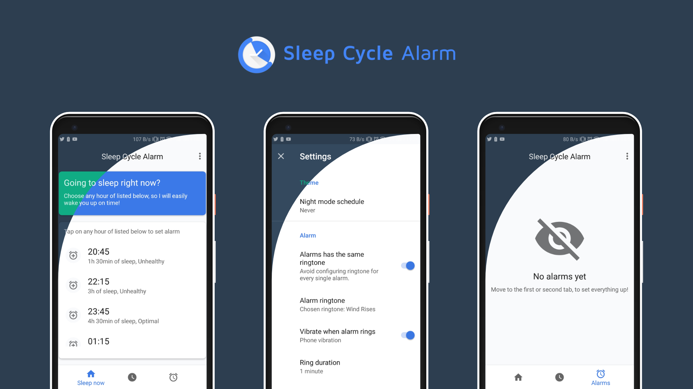

<h4 align="center">Sleep Cycle Alarm is a free material-designed Android app which helps waking up during a light sleep, it also is ad-free and open source under GPLv3 license.</h4>

  
  
  
  
  
  

#### Features

* Custom alarm management system
* Alarms customatization
* Automatically cleans up used up alarms
* Adds new alarm with only two taps from user
* Shows list of hours to set alarm at to wake up with light sleep cycle
* Shows list of hours to go to sleep at when user wants to wake up at specific hour
* Dark and light theme
* Informs user about sleep duration and quality of specific alarm
  
#### Dependencies

* [Butterknife](https://github.com/JakeWharton/butterknife)
* [Realm](https://github.com/realm/realm-java)
* [Android-Support-Preference-V7-Fix](https://github.com/Gericop/Android-Support-Preference-V7-Fix)
* [Joda-time](https://github.com/JodaOrg/joda-time)
* [EventBus](https://github.com/greenrobot/EventBus)

#### Contributing

You can trace the status of known issues [here](https://github.com/letelete/Sleep-Cycle-Alarm/issues),
also feel free to file a new issue (helpful description, screenshots and logcat are appreciated), or join to my discord  and send a message on #programming text channel if you have any questions.
