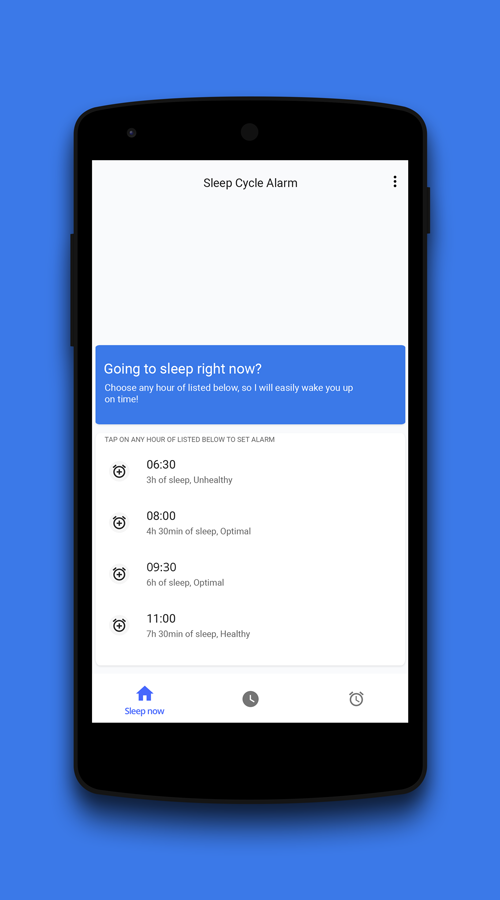
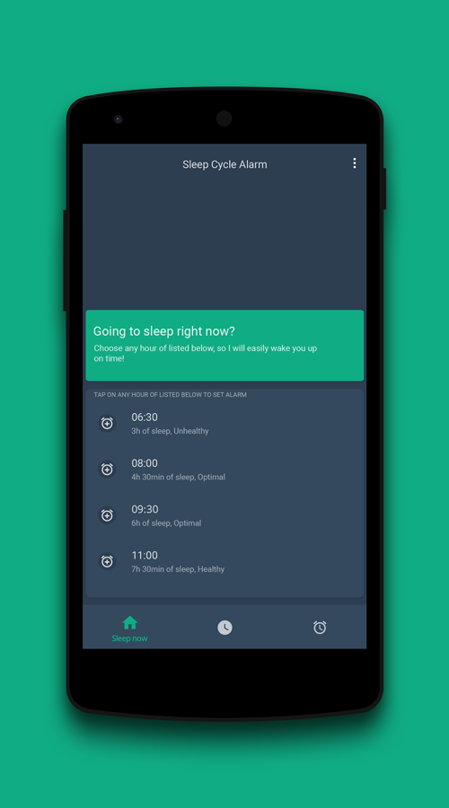
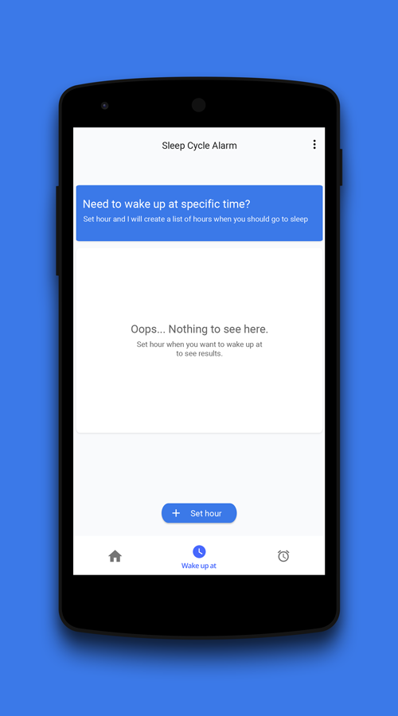
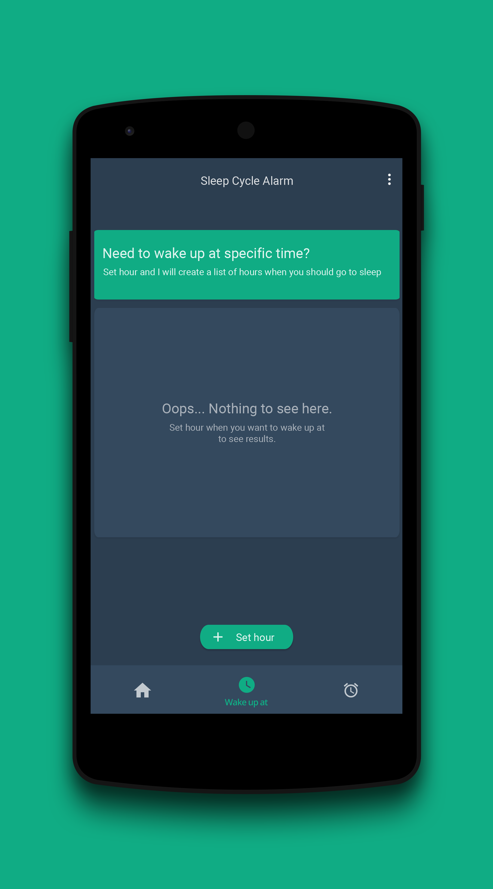
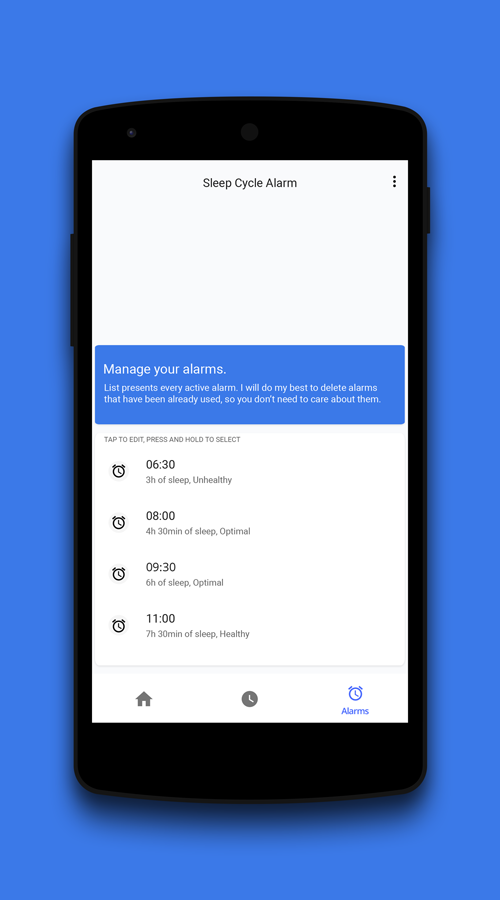

[-2ecc71.svg)](https://github.com/letelete/Sleep-Cycle-Alarm)

📌 **IT'S NOT STABLE VERSION YET**

* App is still under heavy development. First stable version will be available on Google Play.

Sleep Cycle Alarm is a material-designed Android app which helps waking up during a light sleep, it also is ad-free and open source under GPLv3 license. It has it's own alarm management system so the user doesn't need to care about removing already used alarms. 

<!-- TODO:

-->

  

#### :camera: Screenshots

#### :octocat: Contributing

##### Code 

If you wish to contribute to the project, please do the following steps:
1. Fork a project
2. Create your feature branch: `git checkout -b feature-name`
3. Add your changes `git add .`
4. Commit your changes `git commit -m "Commit message"`
5. Push to the branch: `git push origin feature-name`
6. Submit a pull request

##### Issues

You can trace the status of known issues [here](https://github.com/letelete/Sleep-Cycle-Alarm/issues),
also feel free to file a new issue (helpful description, screenshots and logcat are appreciated), or join to my [discord](https://discord.gg/7Rgg5Zc) server and send a message on #github text channel if you have any questions.

##### Translations

We are currently not accepting translations until english version will not reach final form.
<!-- TODO:
If you are able to contribute with a new translation of a missing language or if you want to improve an existing one, we greatly appreciate any suggestion!
The project uses [Lokalise](https://lokalise.co/URL_TO_PROJECT), a platform that allows anybody to contribute to translating the app
-->

#### :gem: Features

  * Custom alarm management system
  * Alarms customatization
  * Automatically cleans up used up alarms
  * Adds new alarm with only two taps from user
  * Shows list of hours to set alarm at to wake up with light sleep cycle
  * Shows list of hours to go to sleep at when user wants to wake up at specific hour
  * Dark and light theme
  * Informs user about sleep duration and quality of specific alarm
  
#### ⭐️ Third-Party Dependencies Used

  * [Butterknife](https://github.com/JakeWharton/butterknife)
  * [Realm](https://github.com/realm/realm-java)
  * [Android-Support-Preference-V7-Fix]  (https://github.com/Gericop/Android-Support-Preference-V7-Fix)
  * [Joda-time](https://github.com/JodaOrg/joda-time)
  * [EventBus](https://github.com/greenrobot/EventBus)

#### :books: Licensing

Sleep Cycle Alarm is licensed under the [GNU v3 Public License](https://github.com/letelete/Sleep-Cycle-Alarm/blob/master/LICENSE).
In addition to the terms set by the GNU v3 Public License, we ask that if you use any code from this repository that you send us a message to let us know.

#### 👍 If you like this project

you can share your love by buying me a coffee!

